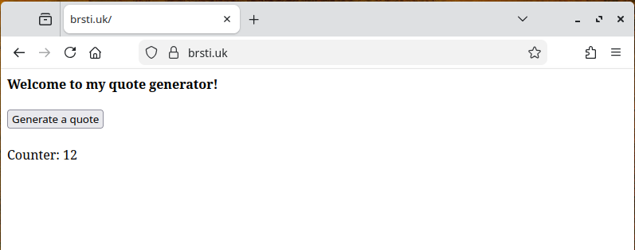
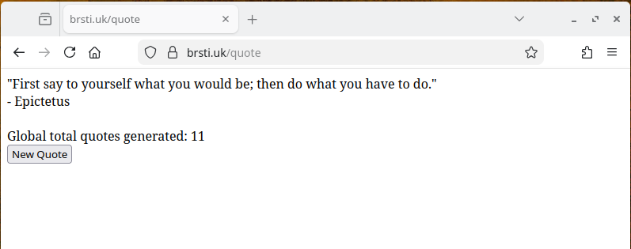

# Quotes Project

A containerised quote generator built with Flask, Redis, and Nginx. Serves random Stoic quotes with a persistent visit and quote counter.

Further develops from my [flask-redis-project](https://github.com/ei-sei/DevOps/tree/docker-lab).

## Stack

| Service | Technology |
|---------|-----------|
| Web app | Python / Flask |
| Cache / counters | Redis |
| Reverse proxy | Nginx |
| Containerisation | Docker + Docker Compose |

## Features

- Random quote served from a JSON file on each request
- Global quote counter tracked in Redis
- Home page visit counter tracked in Redis
- Persistent storage via Redis AOF + named volume

## Routes

| Route | Description |
|-------|-------------|
| `GET /` | Home page with visit counter |
| `GET /quote` | Returns a random Stoic quote |

## Preview




## Running Locally

Create .env variable with following values
```

REDIS_HOST=redis
REDIS_PORT=6379
```

```bash
docker compose up --build
```

Visit `http://localhost` in your browser.

## Deployment (EC2)

**Deploy**
```bash
git clone https://github.com/ei-sei/quotes
cd quotes
# Add your .env file
docker compose up --build -d
```

**If Docker is not installed**
```bash
# Remove any old versions
sudo apt remove docker docker-engine docker.io containerd runc

# Install via convenience script (easiest)
curl -fsSL https://get.docker.com -o get-docker.sh
sudo sh get-docker.sh

# Add your user to the docker group (so you don't need sudo every time)
sudo usermod -aG docker $USER
newgrp docker

# Verify
docker --version
docker compose version
```

Ensure port 80 is open in your EC2 security group.
